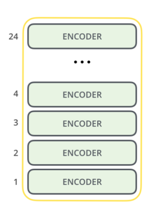

## What is BERT ?
- BERT stands for “Bidirectional Encoder Representation with Transformers”. To put it in simple words BERT extracts patterns or representations from the data or word embeddings by passing it through an encoder. The encoder itself is a transformer architecture that is stacked together. It is a bidirectional transformer which means that during training it considers the context from both left and right of the vocabulary to extract patterns or representations.
  

    

### BERT uses two training paradigms - Pre-training and Fine-tuning. 
- During __pre-training__, the model is trained on a large dataset to extract patterns. This is generally an unsupervised learning task where the model is trained on an unlabelled dataset like the data from a big corpus like Wikipedia.
- During __fine-tuning__ the model is trained for downstream tasks like Classification, Text-Generation, Language Translation, Question-Answering, and so forth. Essentially, you can download a pre-trained model and then Transfer-learn the model on your data

## Core components of BERT
#### The Transformers 
- BERT’s main component is the transformer architecture. The transformers are made up of two components: encoder and decoder. The encoder itself contains two components: the self-attention layer and feed-forward neural network.
